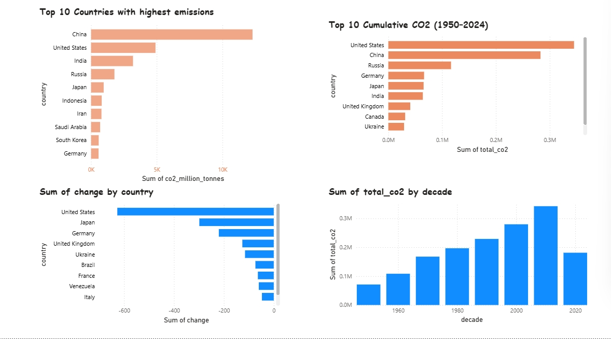
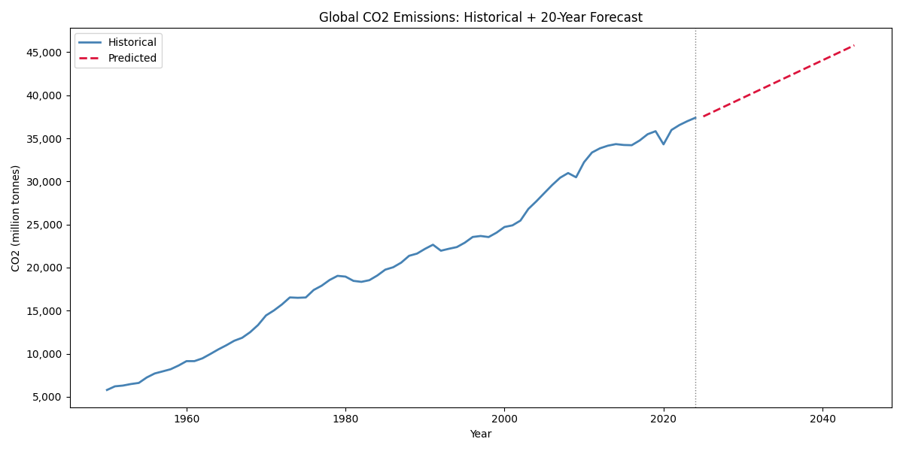

# Global co2 emissions analysis
This project analyzes global CO2 emissions from 1950 to 2024 across 199 countries,
using Python, SQL, Excel, Power BI.

## Important Insights
-  China is the largest emitter in 2024 but USA has the highest cumulative emissions since 1950 meaning China's growth accelerated rapidly after year 2000.
-  USA reduced most emissions in absolute terms from 2014–2024,likely cause by coal to gas transition and renewables.
-  Global CO2 has never decreased across any decade since 1950.
## Tools Used
- **Python** — Data cleaning, EDA, visualization (pandas, matplotlib)
- **SQL** — Business question analysis 
- **Excel** — Summary tables
- **Power BI** — Interactive dashboard
## Dashboard Preview

## Forecast Preview

